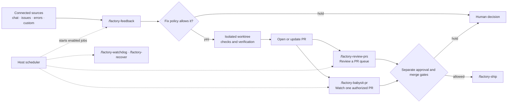

# Experimental software factory

> **Experimental:** Factory skills install agent instructions. They do not add
> integrations, credentials, scheduled jobs, or permission grants. Host support
> and the configuration conventions can change.

Factory is a set of composable skills for turning configured product and
maintenance signals into reviewed software changes. Each action has its own
autonomy policy: fixing an issue does not automatically authorize a reply,
approval, merge, deployment, or issue closure.

## Workflow at a glance

Factory uses the read-capable integrations and scheduler already available in
your agent host. The source names below are examples; there is no fixed Factory
connector catalog.



The diagram shows possible handoffs, not automatic permissions. Every recurring
job must be created and verified in the host scheduler.

## Install

Run the interactive installer and select **Factory** to preselect the group.
You can remove individual skills, then choose clients and install scope:

```sh
npx @agent-native/skills@latest add
```

Every Factory skill is marked experimental in the installer and skills list.

## Skills

| Skill | Use it for |
| --- | --- |
| `/factory` | Choose sources, policies, schedules, worktrees, and host automations. |
| `/factory-feedback` | Read and disposition configured feedback, issues, and error reports. |
| `/factory-review-prs` | Review a filtered queue of PRs; apply separate reply, approval, and merge rules. |
| `/factory-babysit-pr` | Follow one explicitly authorized PR, fix in-scope findings, and apply separate publish, reply, approval, merge, and soak rules. |
| `/factory-ship` | Publish and complete delivery work under the project's policy. |
| `/factory-watchdog` | Find stalled, explicitly authorized delivery work and notify only when a concrete next step is due. |
| `/factory-recover` | Resume an interrupted run only when its original authorization and worktree are still valid. |

`/factory-review-prs` is a queue sweep. `/factory-babysit-pr` follows one PR.
`/factory-watchdog` looks for stopped delivery work. `/factory-recover` handles
interrupted runs. Use `/agent-watchdog` for a general audit of another agent's
session or diff; it does not replace these Factory workflows.

## Configure

Run `/factory` in the project where the workflows should operate. It reads the
project's `.agent-factory/config.yaml`, shows the read-capable integrations
available in the host, and asks about missing scopes and policies. You can use
Slack, GitHub Issues, Jira, Sentry, or another source if the host exposes a
read-capable connector or MCP/API tool for it. Add your own source by describing
that tool, its query arguments, filters, and pagination in the config; the
Factory skills cannot connect a provider that the host does not expose.

The [configuration reference](configuration.md) contains a starter config and
describes every documented property, policy, custom-source field, and host
limitation.

The setup flow is:

1. **Choose sources and scope.** Name the connected tool and exact channel,
   repository, project, or other boundary.
2. **Set action policies separately.** Choose when the agent may fix, reply,
   close, review, approve, publish, merge, deploy, recover, or notify.
3. **Choose schedules and isolation.** Use host-supported schedules and a clean,
   automation-owned worktree for code-changing jobs.
4. **Create and verify host automations.** A YAML schedule is only a request;
   `/factory` must read the saved job settings back and report anything the host
   could not configure.

The config is an agent-readable convention, not a validated schema. Unknown
fields do not install connectors or create jobs. Provider-specific fields must
be explained clearly and confirmed with the host.

## Start with low autonomy

- Begin with manual runs or read-only source enumeration.
- Confirm source scope, pagination, counts, and unavailable integrations.
- Try one low-risk fix and verify it with the project's checks.
- Review sample replies and notifications before enabling them.
- Enable PR approval, merge, or deployment only with explicit criteria and
  live-state checks. Keep production deployment independent from merge.

Missing, partial, stale, or unreadable evidence is a hold for a person. The
skills never infer permission for one action from another.

## Limits

- Integrations, credentials, scheduler features, and worktree support come from
  the agent host and connected tools.
- Config values such as schedules, filters, and policy text may need host- or
  project-specific syntax.
- A configured job can still fail to run. Verify its saved schedule and review
  run history before relying on it.
