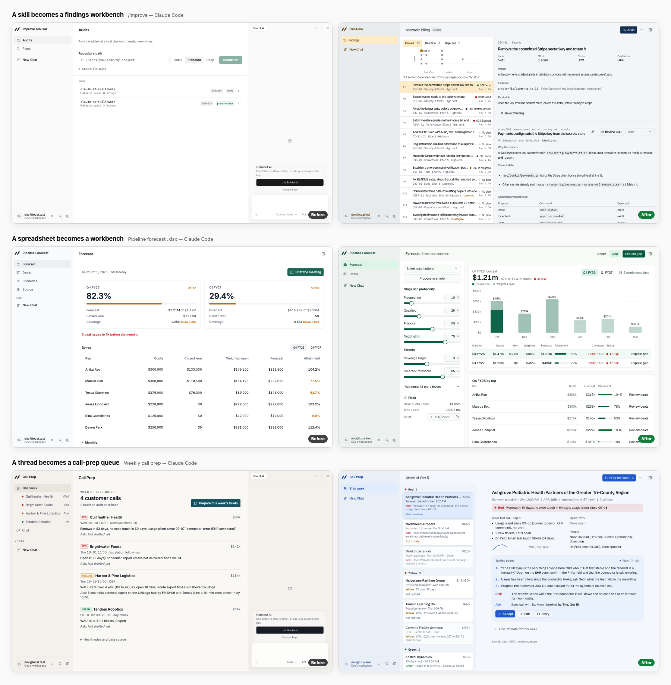

# Turn Into App

Give a workflow you have already proven the face of an app and the brain of an
agent. `/turn-into-app` turns a thread, a skill, a spreadsheet, or a Claude or
ChatGPT project into a visual [Agent-Native](https://agent-native.com) app: a
populated, domain-shaped interface (a week grid, a board, a live workbench, a
triage queue) with the agent working behind buttons on the objects it acts on.

A form under a step bar is the failure it is built to avoid. The app opens on
your world, already populated, not on step one of your procedure.



## What you get

- **A real interface for the workflow.** The skill picks the shape of the app
  from the shape of the source: a schedule grid for appointments, a pipeline
  board for stages, a live workbench with sliders and a chart for a spreadsheet
  model, a triage queue with a drafted reply, a research brief with sources.
- **Sample data, not an empty form.** The first screen is full of realistic,
  synthetic data shaped like your source, labelled as sample data, with the edge
  cases your workflow cares about.
- **An agent that works where you click.** Buttons sit on the objects they act
  on. Click one and the object shows the agent working while the run streams in
  the sidebar; the result lands back in the app, ready to accept, edit, or retry.
- **A committed visual direction.** One of six named directions with real
  light and dark tokens, so the app does not look like a grey template.
- **A screenshot review before handoff.** The skill runs the app, captures it at
  desktop and phone sizes in light and dark, scores the screenshots against a
  rubric, fixes what it finds, and names the screenshots in its report.
- **A real Agent-Native app.** Shared actions the UI and the agent both call,
  the normal Use Builder.io / add your own keys setup, `pnpm dev` locally, and a
  build and deploy path.

## Install

```sh
npx @agent-native/skills@latest add --skill turn-into-app
```

## Try it

- `/turn-into-app` at the end of a thread that proved a repeatable job.
- `/turn-into-app /some-skill` to package a skill, even at the start of a thread.
- `/turn-into-app ./forecast.xlsx` to turn a spreadsheet into a workbench with a
  sheet-versus-app before and after.
- `/turn-into-app ./project-export/` to turn a Claude or ChatGPT project's
  instructions, knowledge files, and past runs into an app.

## How it works

1. **Brief.** It reads the whole source and posts a short brief: the job, inputs
   and outputs, the one to three judgment-heavy agent moments, and the source's
   own rules and data hazards. It does not wait for an answer.
2. **Design.** It names the archetype, the visual direction, the shell, the
   sample data, and where each agent moment lands, before writing any UI.
3. **Scaffold.** It creates a new app with the real Agent-Native scaffold and
   never overwrites an existing app.
4. **Build.** Deterministic work becomes actions; the surface, the sample data,
   and the agent moments are built together.
5. **Review.** It runs the app, looks at the screenshots, and refines.
6. **Verify.** Typecheck, doctor, build, and a report that separates what is
   running, verified, build-ready, and deployed.

## Hosts

- **Claude Code, Codex, Cursor, and other local coding agents** build, run, and
  verify the app in your checkout.
- **Claude and ChatGPT on the web** hand a bounded brief to Builder through the
  Dispatch connector. That host cannot run the app, so the handoff reports what
  Dispatch returned and stays pending until the branch is built.

## Sources

- **Threads and local transcripts.** The last concrete, repeatable job is the
  product. A worked example is sample data, not the schema.
- **Skills.** The skill's own steps, human decision points, and read-only rules
  become the app. A skill that keeps files keeps them as the source of truth.
- **Spreadsheets.** Every worksheet is inventoried first. Structure decides which
  cells are inputs and outputs, never colour alone, and the workbook is never
  copied into a prompt or a database. One compact question is asked only when the
  mapping is genuinely ambiguous.
- **Claude and ChatGPT projects.** Visible instructions, knowledge files, and
  past runs are the source. The connector never reads hidden project history and
  there is no shared-link importer; attach an export when the context is not
  visible.

The result is the concrete workflow app, never a generic "what app do you want to
make?" form. For a local preview without an account, set `AUTH_DISABLED=1` in the
ignored `.env`; never commit or deploy that setting.
